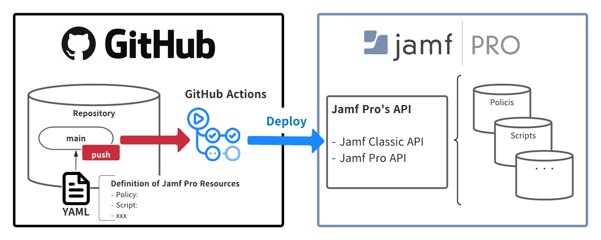

# jamf-pro-manager

jamf-pro-manager は Jamf Pro のリソースを宣言的に管理するためのツールです。

## Overview



- 構成ファイル (`deployConfig.yml`) で定義されたリソースを Jamf Pro にデプロイします。
    - 現時点で対応しているオブジェクトは以下です。
        - `Policies`
        - `Scripts`
        - `Computer Groups (Smart/Static)`
        - `Categories`
- `main` ブランチへの push をトリガとして GitHub Actions が実行されます。
- GitHub Actions では以下の操作を行います。
    - 定義したリソースのデプロイ
    - 構成ファイルの更新・自動コミット
        - リソースの新規作成時: Jamf Pro 上で割り当てられた ID の追記、 GitHub Actions の Run Number 等の追記
        - リソースの更新時: GitHub Actions の Run Number 等の追記


## Setting

### Jamf Pro

- デプロイ (Jamf Pro の API にアクセス)するための Jamf Pro アカウントの準備
    - 以下を参考に、必要最低限のカスタム権限を付与します。
    - [Classic API Minimum Required Privileges and Endpoint Mapping](https://www.jamf.com/developers/apis/classic/overview/required-privileges/)

### GitHub Actions

- Jamf Pro の各種情報を設定
    - `.github/workflows/main.yml` で環境変数を設定します
        - `JAMF_URL` ... Jamf Pro のベース URL (ex; https://hogehoge.jamfcloud.com)
        - `JAMF_USER` ... Jamf Pro アカウントのユーザ名
          ```yaml
          # .github/workflows/main.yml
             ~
           - name: deploy
                  env:
                    JAMF_URL: "https://<your-tenant-name>.jamfcloud.com"
                    JAMF_USER: "<User name of Jamf Pro account>"
                    JAMF_USER_PASSWORD: ${{ secrets.JAMF_USER_PASSWORD }}   # GitHub Secrets
          ```

    - Secrets に `JAMF_USER` で指定した Jamf Pro アカウントのパスワードを登録します。[操作方法](https://docs.github.com/ja/actions/reference/encrypted-secrets#creating-encrypted-secrets-for-a-repository)
        - Name: `JAMF_USER_PASSWORD`
        - Value: <パスワードの文字列>

## Usage

- 本リポジトリを clone
  ```shell
  git clone git@github.com:pirox07/jamf-pro-manager.git
  ```

- `template` をコピーして、デプロイするリソース用にディレクトリを作成
   ```shell
   cp template <Resources Name>
   ```
    - Resource Name は任意の値としてください。

- `deployConfig.yml` で各パラメータを定義
    - 各要素のパラメータのこちらを参照してください。
        - [The Classic API Reference - Policies](https://www.jamf.com/developers/apis/classic/reference/#/policies)
        - [Jamf Pro API - Scripts](https://www.jamf.com/developers/apis/jamf-pro/reference/#/scripts)
    - `id:` で定義した値によって、各種リソースのデプロイ操作を制御します。
        - `id: 0` ... 定義したリソースを新規作成
        - `id: 0 以外の値` ... 当該 ID のリソースを更新

- main ブランチに push
    - 直前の commit から更新のあったディレクトリをデプロイ対象として識別し、 GitHub Actions により自動デプロイします。

### Policies

- `policy:` で各種パラメータを定義します。
- 単一の `deployConfig.yml` 内では、ひとつの Policy を定義します。(複数の Policy は定義できません。)


### Scripts

- `script:` で各種パラメータを定義します。
- 単一の `deployConfig.yml` 内で、複数の Script を定義できます。
- `scriptContents` の値のみ `deployConfig.yml` の外部で定義します。
    - `name:` で定義した値と同一ファイル名のスクリプトファイルを、ディレクトリ内に配置してください。
- `notes` には GitHub Actions の Run Number 等の値が自動的に定義されます。
    - デプロイ時にスクリプトファイルの内容を読み取ります。


### Computer Groups

- `computer_group:` で各種パラメータを定義します。
- `is_smart:`
    - `true` ... `Smart Computer Group`
    - `false` ... `Static Computer Group`

### Categories

- `category:` で各種パラメータを定義します。
